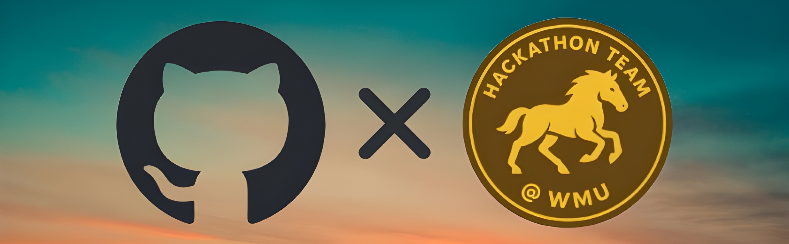
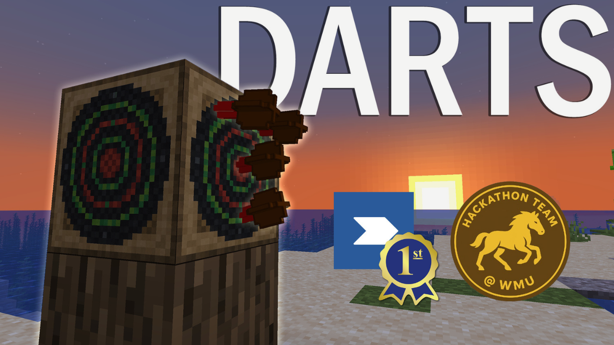

# Hackathon Team @ WMU

## Let's start building.

---

Welcome to the official GitHub organization for the Hackathon Team of the Developer Club at Western Michigan University!

### About Us

We are a passionate group of student developers from the [Developer Club at WMU](https://discord.com/invite/G9yE5s6NFM) Our goal is to collaborate, learn, and build innovative projects during hackathons. We participate in various local, national, and online hackathons, tackling diverse challenges and exploring new technologies.

### 🚀 Current/Upcoming Hackathons

Stay tuned for information about the hackathons we're currently participating in or planning to attend!

* *[Sprint.dev Reactiflux Hackathon, May 23-26]*

### 🏆 Past Projects

Here you'll find repositories for projects we've developed in previous hackathons.

*[https://github.com/Hackathon-Team-WMU/partygames]* - (1st Place) Built a minecraft neoforge mod that adds throwing darts into minecraft, challenge friends and track your score.

### 🤝 How to Join / Get Involved

Are you a WMU student interested in coding, design, or project management and want to experience the thrill of a hackathon?

* **Join the Developer Club at WMU:** This is the best way to get connected with us. [link in bio]
* **Contact Us:** Have questions? Reach out to [add email].
* **Look out for announcements:** We'll post about team formation for upcoming hackathons in the Developer Club channels.

### ---

We're excited to learn, build, and innovate together!
